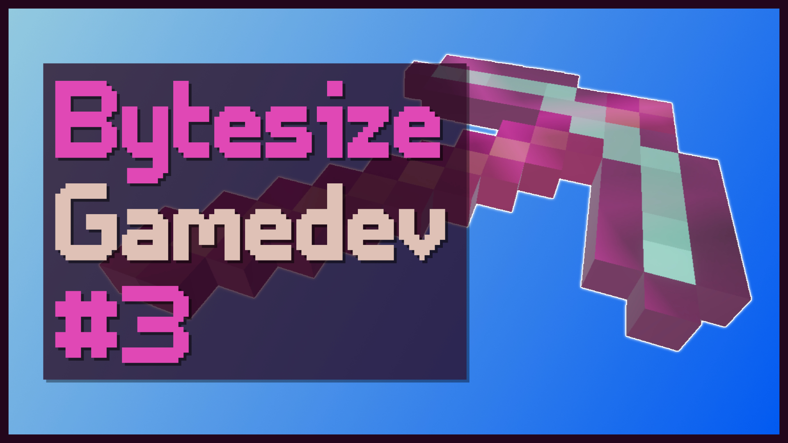

# Bytesize Gamedev: Minecraft Enchantment in URP

Bytesize Gamedev is a series of short videos about mini gamedev tips, primarily in Unity. This one is a Minecraft tool enchantment effect in Shader Graph.

## Overview

The video to go along with this repository can be found on [YouTube](https://www.youtube.com/watch?v=iRegHo8_GBk), with an extended thread on [Twitter]().

## Software

Made with Unity 2020.2.1f1 and URP/Shader Graph 10.2.2. The general concepts should work in most versions of Shader Graph.

## Authors

This project and the corresponding tutorial series were written by Daniel Ilett. [Follow him on Twitter](https://twitter.com/daniel_ilett) for more gamedev tutorials!

## Release

This project was released on January 29th 2021.
